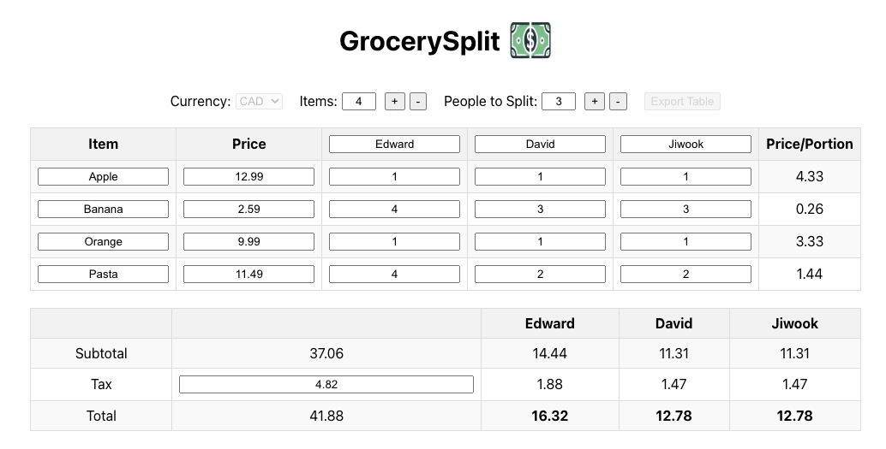

# Grocery Split

**Grocery Split** is a web application designed to simplify the process of splitting grocery bills among friends. The application is hosted at [grocerysplit.edwardjwkim.com](http://grocerysplit.edwardjwkim.com).

**For now, I recommend using Grocery Split from a computer or tablet browser. If using a mobile device, please use it in horizontal orientation.**

### Instructions

1. **Enter the number of people and items**: You can add up to 10 people and 100 items for splitting.

2. **Input the item details**: For each item on your receipt, enter its name, price, and the portion each person consumed. For example, if you bought 10 bananas for $2.59, and Edward ate 4, David ate 3, and Jiwook ate 3, input the portions as 4, 3, and 3 for Edward, David, and Jiwook respectively.

3. **Adjust for tax or discounts**: After all the item prices and portions are entered, input the total tax amount. If there was a discount, enter it as a negative number or adjust the tax - discount value to match the total amount on your receipt.

4. **Review totals**: The total amount for each person will be displayed in the "Total" row, indicating how much each individual owes.

### Background

I always go grocery shopping with my friends because buying in bulk often makes things cheaper. 

However, we faced a challenge: not only did we want to split the bill easily by each product, but we also wanted to account for different quantities of products we each take.

For example, if my friends Brad, Jack, and I buy a box of 50 apples, and Brad wants 30 apples, I want 5, and Jack wants 15, we need a way to divide and split our grocery bill by both the product and the quantity each person shares.

**Grocery Split** was created to address this need. It is intuitive to use and specifically designed to facilitate the splitting of bills based on individual product quantities.

## Available Scripts

In the project directory, you can run:

### `npm start`

Runs the app in development mode.\
Open [http://localhost:3000](http://localhost:3000) to view it in the browser.

The page will reload if you make edits.\
You will also see any lint errors in the console.

### `npm test`

Launches the test runner in interactive watch mode.\
See the section about [running tests](https://facebook.github.io/create-react-app/docs/running-tests) for more information.

### `npm run build`

Builds the app for production to the `build` folder.\
It correctly bundles React in production mode and optimizes the build for the best performance.

The build is minified and the filenames include the hashes.\
Your app is ready to be deployed!

See the section about [deployment](https://facebook.github.io/create-react-app/docs/deployment) for more information.

### `npm run eject`

**Note: this is a one-way operation. Once you `eject`, you can’t go back!**

If you aren’t satisfied with the build tool and configuration choices, you can `eject` at any time. This command will remove the single build dependency from your project.

Instead, it will copy all the configuration files and the transitive dependencies (webpack, Babel, ESLint, etc) right into your project so you have full control over them. All of the commands except `eject` will still work, but they will point to the copied scripts so you can tweak them. At this point, you’re on your own.

You don’t have to ever use `eject`. The curated feature set is suitable for small and middle deployments, and you shouldn’t feel obligated to use this feature. However, we understand that this tool wouldn’t be useful if you couldn’t customize it when you are ready for it.

## Learn More

You can learn more in the [Create React App documentation](https://facebook.github.io/create-react-app/docs/getting-started).

To learn React, check out the [React documentation](https://reactjs.org/).
